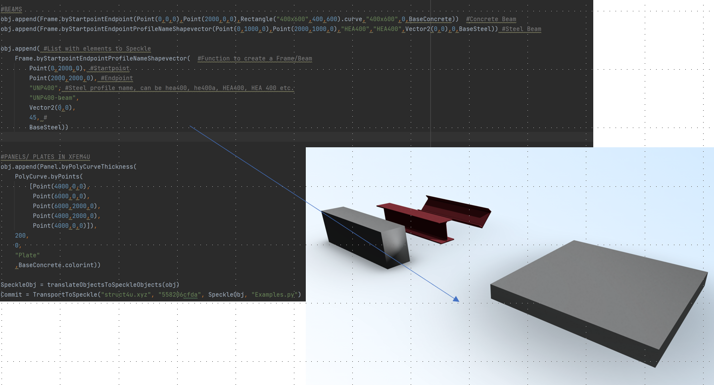
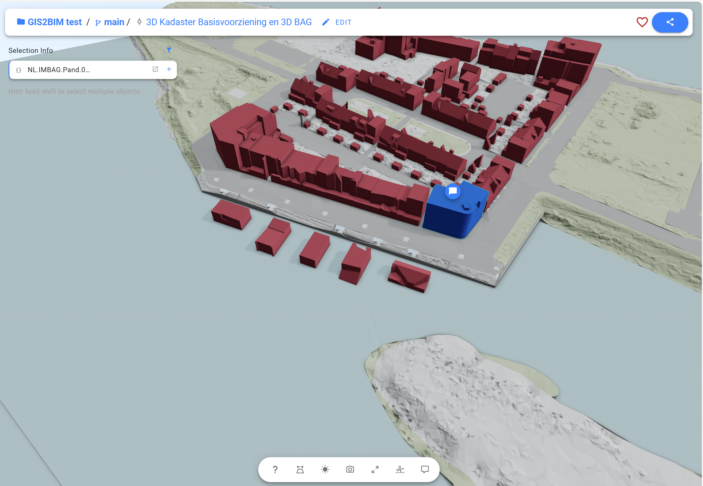

# building.py
A Python library for creating buildings, building systems, objects, and exporting them to various programs such as Blender, Revit, and Speckle.

# Why?
In the realm of building design, almost everything can be categorized as a frame or a panel – from windows and curtain walls to floor systems. The aim of the building.py project is to automate the creation of these systems.

Goals of the building.py Project:
* Develop a Python library for geometry creation without dependencies.
* Provide export options to:
  * Speckle
  * FreeCAD
  * Revit
  * XFEM4U
  * IFC using IFCOpenShell
  * Scia Engineer
 
# Design principles
* Create 
# Implemented

Group | Part | Implemented | ToSpeckle | ToFreeCAD 
--- | --- | --- | --- | --- 
Abstract | Vector3 | :heavy_check_mark: |  |  
&nbsp; | Vector2 | :heavy_check_mark: |  |  
&nbsp; | Plane | :heavy_check_mark: |  |  
&nbsp; | CoordinateSystem | :heavy_check_mark: |  |  
&nbsp; | Color | :heavy_check_mark: | :heavy_check_mark: |  
&nbsp; | Material | :heavy_check_mark: | |  
Geometry | Point3D | :heavy_check_mark: | :heavy_check_mark:  |  
&nbsp; | Line | :heavy_check_mark: | :heavy_check_mark:  |  
&nbsp; | Arc | :heavy_check_mark: | :heavy_check_mark:  |  
&nbsp; | PolyCurve | :heavy_check_mark: | :heavy_check_mark:  |  
&nbsp; | Point2D | :heavy_check_mark: | :heavy_check_mark:  |  
&nbsp; | Line2D | :heavy_check_mark: | :heavy_check_mark:  |  
&nbsp; | Arc2D | :heavy_check_mark: | :heavy_check_mark:  |  
&nbsp; | PolyCurve2D | :heavy_check_mark: | :heavy_check_mark:  |  
&nbsp; | LineStyle | :heavy_check_mark: | :heavy_check_mark:  |  
&nbsp; | Text | :heavy_check_mark: | :heavy_check_mark:  |  
&nbsp; | Mesh | :heavy_check_mark: | :heavy_check_mark:  |  
&nbsp; | BREP | | |  
&nbsp; | Extrusion | :heavy_check_mark: | :heavy_check_mark:  |  
&nbsp; | Sweep | | |  
Objects | Frame | :heavy_check_mark: | :heavy_check_mark:  |  
&nbsp; | FrameConnections | |  |  
&nbsp; | Panel | :heavy_check_mark: | :heavy_check_mark:  |  
&nbsp; | Dimension | :heavy_check_mark: | :heavy_check_mark:  |  
&nbsp; | Tag | :heavy_check_mark: | :heavy_check_mark:  |  
&nbsp; | Component3D | | |  
&nbsp; | Component2D | | |  
&nbsp; | Hatch | :heavy_check_mark: | :heavy_check_mark:  |  
Library | Steelprofiles | |  |  
&nbsp; | Materials | |  |  
Exchange | Speckle | :heavy_check_mark: |  |  
&nbsp; | IFC | |  |  
&nbsp; | PAT |:heavy_check_mark: |  |  
&nbsp; | OBJ | |  |  
&nbsp; | Struct4U |:heavy_check_mark: |  |  
Import | Image | 50% |  |  
&nbsp; | GIS | |  |  
&nbsp; | CityJSON | 50% |  |  

# Versions
Notice that this version is very much a beta version, although it is in our opinion usable. If you use it, feedback is very much appreciated!

We are currently working on version 0.1. Releasedate: april 14 2023
Versions 0.x will be subject to significant changes of the API until the release of version 1 which is planned on january 7 2024.

# Examples

## CrossBondWithJointYellowRed

pat = PatternSystem().stretcher_bond_with_joint("halfsteensverband",100,210,50,10,12.5)

## Kruisverband

